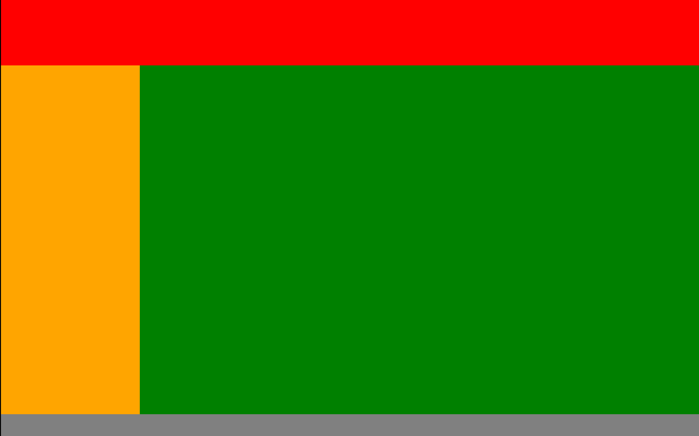

# LearningReact

Learning React from Prasad Kadam sir

## Task: 
- Create a basic webpage using components
- There should be 3 sections:
    - Navbar
    - Home
        - left section
        - main content section
    - Footer

## screenshot

